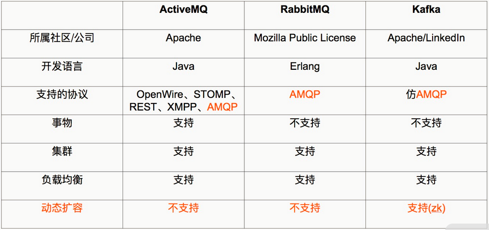
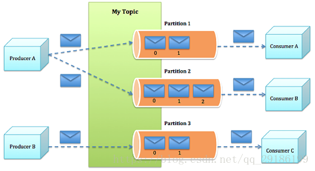
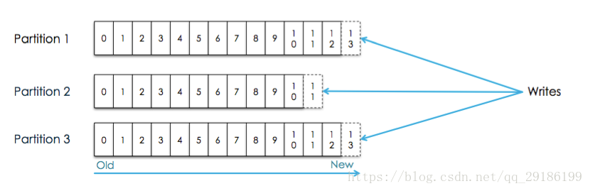
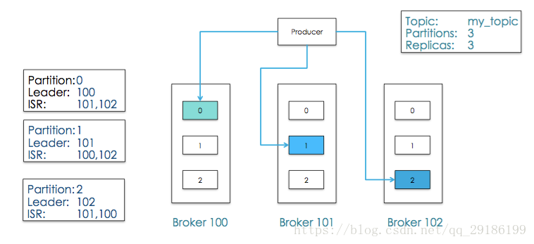
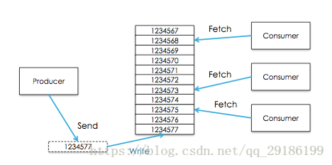
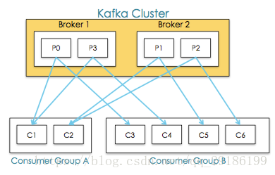
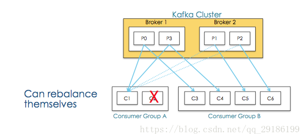
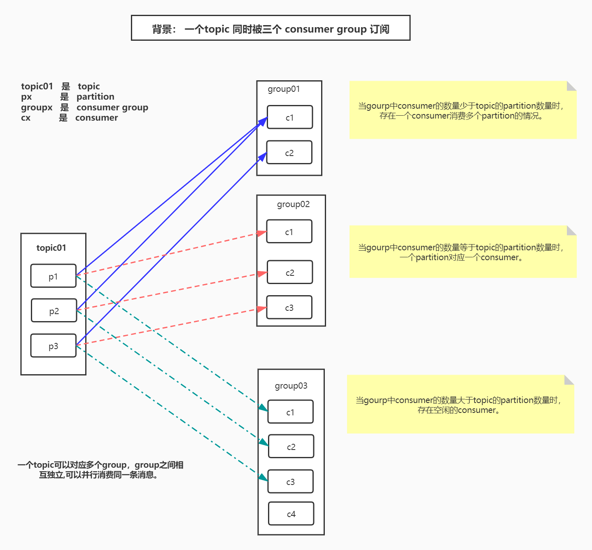

## Kafka工作原理
<!-- TOC -->

- [Kafka工作原理](#kafka工作原理)
  - [1. 简介](#1-简介)
  - [2. Kafka和其他主流分布式消息系统的对比](#2-kafka和其他主流分布式消息系统的对比)
  - [3. kafka的特性](#3-kafka的特性)
  - [4. kafka中概念](#4-kafka中概念)
    - [4.1. topic和消息](#41-topic和消息)
    - [4.2. Producer](#42-producer)
    - [4.3. Consumer](#43-consumer)
    - [4.4. Kafka核心特性](#44-kafka核心特性)
      - [4.4.1. 消息可靠性](#441-消息可靠性)
    - [4.5. consumer、consumer group、partition、topic的关系](#45-consumerconsumer-grouppartitiontopic的关系)
    - [4.6. 结尾](#46-结尾)
      - [4.6.1. produce方面：](#461-produce方面)
      - [4.6.2. customer方面：](#462-customer方面)

<!-- /TOC -->

### 1. 简介
> Apache kafka 是一个分布式的基于push-subscribe的消息系统，它具备快速、可扩展、可持久化的特点。它现在是Apache旗下的一个开源系统，作为Hadoop生态系统的一部分，被各种商业公司广泛应用。它的最大的特性就是可以实时的处理大量数据以满足各种需求场景：比如基于hadoop的批处理系统、低延迟的实时系统、storm/Spark流式处理引擎。  
Kafka所采用的就是发布/订阅模式，被称为一种高吞吐量、持久性、分布式的发布订阅的消息队列系统。

### 2. Kafka和其他主流分布式消息系统的对比

### 3. kafka的特性
1. **高吞吐量、低延迟**：kafka每秒可以处理几十万条消息，它的延迟最低只有几毫秒
2. **可扩展性**：kafka集群支持热扩展
3. **持久性、可靠性**：消息被持久化到本地磁盘，并且支持数据备份防止数据丢失
4. **容错性**：允许集群中节点失败（若副本数量为n，则允许n-1个节点失败）
5. **高并发**：支持数千个客户端同时读写
### 4. kafka中概念
1. **broker**：书架，用于存储消息；Broker主要负责创建Topic，存储Producer所发布的消息，记录消息处理的过程，现是将消息保存到内存中，然后持久化到磁盘
2. **topic**：消息的主题；同一个Topic的消息可以分布在一个或多个Broker上，一个Topic包含一个或者多个Partition分区，数据被存储在多个Partition中
3. **partition**：分区；在这里被称为Topic物理上的分组，一个Topic在Broker中被分为1个或者多个Partition，也可以说为每个Topic包含一个或多个Partition，分区在创建Topic的时候可以指定。分区才是真正存储数据的单元
3. **producer**：消息的生产者，将消息放到broker中的指定的topic下
4. **consumer**：消息的消费者，将broker中的指定的topic下的消息取出来消费

#### 4.1. topic和消息
- kafka将所有消息组织成多个topic的形式存储，而每个topic又可以拆分成多个partition，每个partition又由一个一个消息组成。每个消息都被标识了一个递增序列号代表其进来的先后顺序，并按顺序存储在partition中。

- 这样，消息就以一个个id的方式，组织起来。
    1. producer选择一个topic，生产消息，消息会通过分配策略append到某个partition末尾。
    2. consumer选择一个topic，通过id指定从哪个位置开始消费消息，消费完成之后，保留id，下次可以从这个位置开始继续消费，也可以从其他任意位置开始消费。
- 上面的id在kafka中称为offset，这种组织和处理策略提供了如下好处：
    1. 消费者可以根据需求，灵活指定offset消费。
    2. 保证了消息不变性，为并发消费提供了线程安全的保证。每个consumer都保留自己的offset，互相之间不干扰，不存在线程安全问题。
    3. 消息访问的并行高效性。每个topic中的消息被组织成多个partition，partition均匀分配到集群server中。生产、消费消息的时候，会被路由到指定partition，减少竞争，增加了程序的并行能力。
    4. 增加消息系统的可伸缩性。每个topic中保留的消息可能非常庞大，通过partition将消息切分成多个子消息，并通过负责均衡策略将partition分配到不同server。这样当机器负载满的时候，通过扩容可以将消息重新均匀分配。
    5. 保证消息可靠性。消息消费完成之后不会删除，可以通过重置offset重新消费，保证了消息不会丢失。
    6. 灵活的持久化策略。可以通过指定时间段（如最近一天）来保存消息，节省broker存储空间。
    7. 备份高可用性。消息以partition为单位分配到多个server，并以partition为单位进行备份。备份策略为：1个leader和N个followers，leader接受读写请求，followers被动复制leader。leader和followers会在集群中打散，保证partition高可用。

***
#### 4.2. Producer
- producer生成者生产消息需要如下参数：
    1. topic： 消息的主题是什么。往哪个topic生产消息
    2. partition： 消息的分区是什么。把消息放到哪个partition中。
    3. key：根据该key将消息分区到不同的partition
    4. message：消息的内容

***
#### 4.3. Consumer
- 传统消息系统由两种模式：
    1. 队列
    2. 发布订阅
> kafka通过**consumer groupZ**将两种模式统一处理：每个consumer将自己标记consumer group名称，之后系统会将consumer group按名称分组，将消息复制并分发给所有分组，每个分组只有一个consumer能消费这条消息。

- 于是推理出两个极端情况：
    - 当所有的consumer的consumer grouop相同时，一个消息只能被其中一个consumer消费，系统变成队列模式
    - 当每个consumer的consumer group都不相同时，如果group都订阅了此topic，那么一个消息可以被所有的consumer消费， 系统变成发布订阅
- 注意：
    1. consumer groups 提供了topics和 partitions的隔离，如上图consumer group-c2挂掉，consumer-c1会接收配p1,p2,即一个consumer grouoip 中 有其他consumer挂掉后能够重新平衡。如下图：
    
    2. 多consumer并发消费消息，容易导致消息乱序，通过限制消费者为同步，但是这大大降低了程序的并发性。
    > kafka通过partition的概念，保证了partition内消息有序性，缓解了上面的问题。partition内消息会复制分发给所有分组，每个分组只有一个consumer能消费这条消息。这个语义保证了某个分组消费某个分区的消息，是同步而非并发的。如果一个topic只有一个partition，那么这个topic并发消费有序，否则只是单个partition有序。
- 一般消息系统，consumer存在两种消费模型：
    1. push：优势在于消息实时性高；劣势在于没有考虑consumer消费能力和饱和情况，容易导致procuer压死consumer
    2. pull：优势在于可以控制消费速度和消费数量，保证consumer不会出现饱和；劣势在于当没有数据时，会出现空轮询，消耗cpu。
    > kafka采用pull，并采用可配置化参数保证当存在数据并且数据量达到一定量的时候，consumer端才进行pull操作，否则一直处于block状态。kakfa采用整数值consumer position来记录单个分区的消费状态，并且**单个分区单个消息只能被consumer group内的一个consumer消费**，维护简单开销小。**消费完成，broker收到确认，position指向下次消费的offset。由于消息不会删除，在完成消费，position更新之后，consumer依然可以重置offset重新消费历史消息。**

#### 4.4. Kafka核心特性
##### 4.4.1. 消息可靠性
> 在消息系统中，保证消息在生产和消费过程中的可靠性是十分重要的，在实际消息传递过程中，可能会出现如下三种情况：
- 一个消息发送失败
- 一个消息被发送多次
- 最理想的情况：exactly-once，一个消息发送成功且发送了一次

#### 4.5. consumer、consumer group、partition、topic的关系

每个group中可以有多个consumer，每个consumer属于一个consumer group；
通常情况下，一个group中会包含多个consumer，这样不仅可以提高topic中消息的并发消费能力，而且还能提高"故障容错"性，如果group中的某个consumer失效那么其消费的partitions将会有其他consumer自动接管。

对于Topic中的一条特定的消息，只会被订阅此Topic的每个group中的其中一个consumer消费，此消息不会发送给一个group的多个consumer；
那么一个group中所有的consumer将会交错的消费整个Topic，每个group中consumer消息消费互相独立，我们可以认为一个group是一个"订阅"者。

在kafka中,一个partition中的消息只会被group中的一个consumer消费(同一时刻)；
一个Topic中的每个partions，只会被一个"订阅者"中的一个consumer消费，不过一个consumer可以同时消费多个partitions中的消息。

kafka的设计原理决定,对于一个topic，同一个group中不能有多于partitions个数的consumer同时消费，否则将意味着某些consumer将无法得到消息。

kafka只能保证一个partition中的消息被某个consumer消费时是顺序的；事实上，从Topic角度来说,当有多个partitions时,消息仍不是全局有序的。

#### 4.6. 结尾
##### 4.6.1. produce方面：

如果有多个分区，发送的时候按照key值hashCode%partitionNum哈希取模分区数来决定该条信息发往哪个partition, 这里可以自定义partition的分发策略，只要实现Partitioner接口就好，可以自定义成随机分发或者fangwang发往指定分区；

##### 4.6.2. customer方面：

- 对于topic中的partition来说，一个partition只允许一个customer来消费，同一个partition上不允许customer并发；

- Partition数量>customer数量时:一个consumer会对应于多个partitions，这里主要合理分配consumer数和partition数，否则会导致partition里面的数据被取的不均匀 。
- 最好partiton数目是consumer数目的整数倍，所以partition数目很重要，比如取24，就很容易设定consumer数目 。

- Partition数量<customer数量时:   就会有剩余的customer闲置，造成浪费；

- 如果一个consumer从多个partition读到数据，不保证数据间的顺序性，kafka只保证在一个partition上数据是有序的，但多个partition，根据你读的顺序会有不同 ；kafka只保证在一个上数据是有序的（每个partition都有segment文件记录消息的顺序性），无法保证topic全局数据的顺序行；

- partition中的一个消息可以并发的被多个消费者组消费。该消息被消费者组中一个消费者消费

