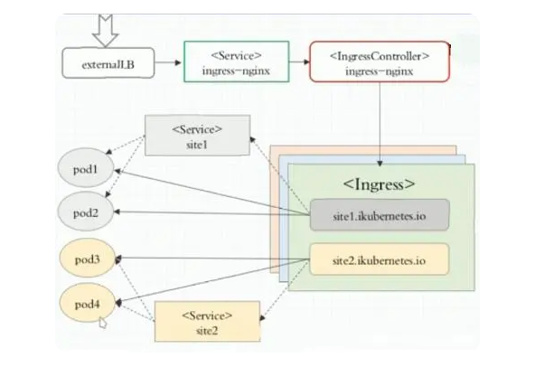

## Kubernet 系列（1）基本概念 
<!-- TOC -->

- [Kubernet 系列（1）基本概念](#kubernet-系列1基本概念)
  - [1. 简介](#1-简介)
  - [2. 架构图](#2-架构图)
  - [3. 重要概念](#3-重要概念)
    - [3.1. Kubernetes主要由以下几个核心组件组成：](#31-kubernetes主要由以下几个核心组件组成)
    - [3.2. 除了核心组件，还有一些推荐的Add-ons：](#32-除了核心组件还有一些推荐的add-ons)
    - [service的类型](#service的类型)
  - [权限配置](#权限配置)
    - [RBAC](#rbac)
    - [ingress](#ingress)
  - [开放接口](#开放接口)
    - [CNI  :Flannel,Calico](#cni--flannelcalico)

<!-- /TOC -->
### 1. 简介
- Kubernetes是一个开源的，用于管理云平台中多个主机上的容器化的应用，Kubernetes的目标是让部署容器化的应用简单并且高效（powerful）,Kubernetes提供了应用部署，规划，更新，维护的一种机制。
- Kubernetes一个核心的特点就是能够自主的管理容器来保证云平台中的容器按照用户的期望状态运行着（比如用户想让apache一直运行，用户不需要关心怎么去做，Kubernetes会自动去监控，然后去重启，新建，总之，让apache一直提供服务），管理员可以加载一个微型服务，让规划器来找到合适的位置，同时，Kubernetes也系统提升工具以及人性化方面，让用户能够方便的部署自己的应用（就像canary deployments）
### 2. 架构图

### 3. 重要概念
> 在这张系统架构图中，我们把服务分为运行在工作节点上的服务和组成集群级别控制板的服务。

> Kubernetes节点有运行应用容器必备的服务，而这些都是受Master的控制。

> 每次个节点上当然都要运行Docker。Docker来负责所有具体的映像下载和容器运行。


#### 3.1. Kubernetes主要由以下几个核心组件组成：
- **etcd**：保存了整个集群的状态；键值对数据库，存储k8s集群所有重要信息（持久化）
- **apiserver**：提供了资源操作的唯一入口，并提供认证、授权、访问控制、API注册和发现等机制；
- **controller manager**：负责维护集群的状态，比如故障检测、自动扩展、滚动更新等；维持副本期望数目。
- **scheduler**：负责资源的调度，按照预定的调度策略将Pod调度到相应的机器上；选择合适的节点进行分配任务。
- **kubelet**：直接与容器引擎交付，实现容器的生命周期管理，同时也负责Volume（CVI）和网络（CNI）的管理；
- **Container runtime**：负责镜像管理以及Pod和容器的真正运行（CRI）；
- **kube-proxy**：负责写入规则至IPTABLES、IPVS，负责为Service提供cluster内部的服务发现和负载均衡；

**官方提供的**

#### 3.2. 除了核心组件，还有一些推荐的Add-ons：
- **kube-dns**：负责为整个集群提供DNS服务
- **Ingress Controller**：为服务提供外网入口（官方只能实现四层代理，Ingress可以实现七层代理）
- **Heapster**：提供资源监控
- **Dashboard**：提供GUI，给k8s提供一个B/S结构访问体系
- **Federation**：提供一个可以块集群中心的多k8s统一管理的功能
- **Prometheus**：普罗米修斯 提供k8s集群的监控能力
- **Fluentd-elasticsearch**：提供集群日志采集、存储与查询
  **高可用集群副本数据最好是>=3 （奇数个）**

  
  ****
  


#### service的类型
- NodePort ：会直接在物理机上开放一个端口，用于访问本服务；一共有3中路径访问：（nodeIp；serviceIp，podIp）
- ClusterIP ：K8S默认的服务类型，只能在K8S中进行服务通信，自动分配一个仅Cluster内部可以访问的虚拟IP <kube-proxy是iptables 则ping不通，是ipvs 才能ping通 clusterIp>
- LoadBalancer ：在NodePort的基础上，借助Cloud Provider创建一个外部负载均衡器，并将请求转发到NodePort
- ExternalName ：把集群外部的服务引入到集群内部来，在集群内部直接使用。没有任何类型代理被创建


### 权限配置
#### RBAC
- 1. 什么是RBAC
> RBAC全称Role-Based Access Control，是Kubernetes集群基于角色的访问控制，实现授权决策，允许通过Kubernetes API动态配置策略。
- 2. 什么是Role
> Role是一组权限的集合，例如Role可以包含列出Pod权限及列出Deployment权限，Role用于给某个NameSpace中的资源进行鉴权  
  -  Role：授权特定命名空间的访问权限
  - ClusterRole：授权所有命名空间的访问权限
- 3. 什么是ClusterRole
> ClusterRole是一组权限的集合，但与Role不同的是，ClusterRole可以在包括所有NameSpace和集群级别的资源或非资源类型进行鉴权  
  - RoleBinding：将角色绑定到主体（即subject）
  - ClusterRoleBinding：将集群角色绑定到主体
- 4. 什么是Subject
> Subject：有三种Subjects，分别是Service Account、User 、Groups
   - User：用户
   - Group：用户组
   - ServiceAccount：服务账号
- 5. 什么是RoleBinding与ClusterRoleBinding
> RoleBinding与ClusterRoleBindin：将Subject绑定到Role或ClusterRole。其区别在于：RoleBinding将使规则在命名空间内生效，而ClusterRoleBinding将使规则在所有命名空间中生效。

**总结：role/clusterRole 属于一类角色，功能描述为可以对哪些资源拥有哪些操作；Susject可以看做是一个用户组，组内成员拥有相同权限；RoleBinding/clusterRoleBinding 可以看做是一种绑定关系，描述了用户组和role的关联关系，带有cluster前缀的表示该作用生效范围包含了所有namespace**

#### ingress
- Service只支持4层负载均衡，而Ingress有7层功能
- Nginx可以通过虚拟主机域名区分不同的服务，而每个服务通过 upstream进行定义不同的负载均衡池，再加上 location进行负载均衡的反向代理，在日常使用中只需要修改 nginx.conf即可实现，但是在 K8S中又该如何实现这种方式调度呢？
- K8S引入了 ingress自动进行服务的调度， ingress包含两大组件： ingress controller和 ingress。
  - ingress：修改 Nginx配置操作被抽象成了 ingress对象。
  - ingress controller： ingress controller通过与 kubernetes API交互，动态的去感知进集群中 Ingress规则变化，然后读取它，然后读取它，按照它自己的模板生成一段 nginx配置，再写到 nginx Pod中，最后 reload以下，工作流程如下图：  
   

- Ingress 可以解决什么问题？
动态配置服务

如果按照传统方式, 当新增加一个服务时, 我们可能需要在流量入口加一个反向代理指向我们新的服务. 而如果用了Ingress, 只需要配置好这个服务, 当服务启动时, 会自动注册到Ingress的中, 不需要而外的操作.
减少不必要的端口暴露

配置过k8s的都清楚, 第一步是要关闭防火墙的, 主要原因是k8s的很多服务会以NodePort方式映射出去, 这样就相当于给宿主机打了很多孔, 既不安全也不优雅. 而Ingress可以避免这个问题, 除了Ingress自身服务可能需要映射出去, 其他服务都不要用NodePort方式

### 开放接口

- Kubernetes作为云原生应用的的基础调度平台，相当于云原生的操作系统，为了便于系统的扩展，Kubernetes中开放的以下接口，可以分别对接不同的后端，来实现自己的业务逻辑：

- CRI（Container Runtime Interface）：容器运行时接口，提供计算资源   docker  containerd
- CNI（Container Network Interface）：容器网络接口，提供网络资源  
- CSI（Container Storage Interface）：容器存储接口，提供存储资源


#### CNI  :Flannel,Calico

CNI的接口中包括以下几个方法：
```
type CNI interface {
    AddNetworkList(net *NetworkConfigList, rt *RuntimeConf) (types.Result, error)
    DelNetworkList(net *NetworkConfigList, rt *RuntimeConf) error

    AddNetwork(net *NetworkConfig, rt *RuntimeConf) (types.Result, error)
    DelNetwork(net *NetworkConfig, rt *RuntimeConf) error
} 

```
该接口只有四个方法，添加网络、删除网络、添加网络列表、删除网络列表。


 最后简单总结一下 CNI 相关。

    1. k8s 的 kubelet 在启动一个容器之前，会先做一些预先检查以及 csi 的操作
    2. 然后 kubelet 调用 CRI 的接口，通过 grpc 的方式和 CRI runtime 通信，告知 CRI 要创建 pod 了
    3. 随后 CRI 的 Server 端收到通知后调用 OCI 的接口去真正的执行拉起 Pod 的操作
    4. 不过在真的拉起 pod 之前，会先给 pod 创建一个 pause 容器，这个 pause 容器是一个特别小又特别稳定的进程，主要用来挂载网络命名空间和存储资源
    5. 然后 CRI 调用 CNI 提供的接口，先在 /etc/cni/net.d 目录中获取网络插件配置(这个配置由每个插件自己通过 daemonset 的方式拷贝到主机上), 然后把插件的配置作为标准输入, 再把容器的运行时信息作为环境变量, 最后执行插件
    6. CNI 插件执行完毕后, 把执行结果(结果要包含一些关键信息比如 Pod IP 等)直接干到标准输出上
    7. CRI 从标准输出上读取插件执行结果再做后续操作, 后续操作就是拉起真正的容器等


使用 Operator 可以自动化的事情包括：

    按需部署应用
    获取/还原应用状态的备份
    处理应用代码的升级以及相关改动。例如数据库 Schema 或额外的配置设置
    发布一个 Service，要求不支持 Kubernetes API 的应用也能发现它
    模拟整个或部分集群中的故障以测试其稳定性
    在没有内部成员选举程序的情况下，为分布式应用选择首领角色