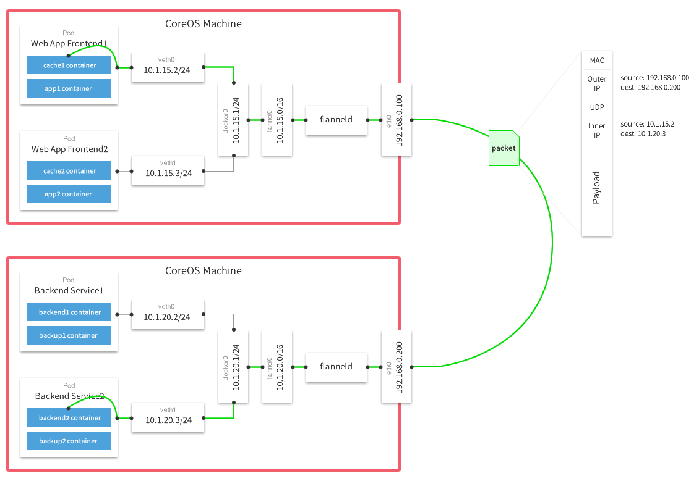

## kubernet系列（3）网络通讯模式
 
<!-- TOC -->

- [kubernet系列（3）网络通讯模式](#kubernet系列3网络通讯模式)
  - [背景](#背景)
  - [通讯方式](#通讯方式)
  - [Flannel 搭建扁平化网络](#flannel-搭建扁平化网络)
    - [简介](#简介)
    - [目的](#目的)
    - [Flannel与K8s的ectd关系](#flannel与k8s的ectd关系)
  - [总结](#总结)
    - [Pod内通信](#pod内通信)
    - [Pod1至Pod2](#pod1至pod2)
    - [Pod至Service通信](#pod至service通信)
    - [Pod至外网](#pod至外网)
    - [外网至Pod](#外网至pod)

<!-- /TOC -->
###  背景
- Kubernetes的网络模式假定了所有Pod都在一个可以直接连通的**扁平的网络空间**中，这在GCE（Google COmpute Engine）里面是现成的网络模型，Kubernetes假定这个网络已经存在。
- 而在私有云力搭建Kubernetes集群，就不能假定这个网络已经存在了，我们需要自己实现这个网络假设，将不同节点上的Docker容器之间的互相访问先打通，然后在运行Kubernetes。

### 通讯方式 
> 1. 同一个Pod内的多个容器之间
- 由于同一Pod中会存在名为“pause”的容器，Pod中的容器都会共用这个网络栈，通过 **localhost+port** 即可访问其它容器。
> 2. 各Pod之间的通讯
- Overlay Network
> 3. Pod与Service之间的通讯
- 各节点的Iptable规则

### Flannel 搭建扁平化网络
#### 简介
- 他的功能是让集群中不同节点主机创建的Docker容器都具有全集群唯一的虚拟IP地址
- 这些IP地址之间建立一个覆盖网络（Over Network），通过这覆盖网络，将数据包原封不动的传递到目标容器内
- Flannel通过给每台宿主机分配一个子网的方式为容器提供虚拟网络，它基于Linux TUN/TAP，使用UDP封装IP包来创建overlay网络，并借助etcd维护网络的分配情况。
- 
#### 目的
- Flannel设计目的就是为集群中所有节点重新规划IP地址的使用规则，**从而使得不同节点上的容器能够获得"同属一个内网"且"不重复的"IP地址，并让属于不同节点上的容器能够直接通过内网IP通信。**
- 简单来说，它的功能是**让集群中的不同节点主机创建的Docker容器都具有全集群唯一的虚拟IP地址**。
  
#### Flannel与K8s的ectd关系
- Flannel给节点分配IP地址段资源
- 监控ectd中每个Pod的实际地址，并在内存中建立维护Pod节点路由表

### 总结
#### Pod内通信
- 同一个Pod共享同一个网络命名空间，共享统一个Linux协议栈。
#### Pod1至Pod2
- Pod1与Pod2不在同一台主机，Pod的地址是与docker0在同一个网段的，但docker0网段与宿主机网卡是两个完全不同的IP网段，并且不同Node之间通信只能通过宿主机的物理网卡进行。将Pod的IP和所在Node的IP关联，通过这个关联让Pod可以互相访问
- Pod1与Pod2在同一台机器，有docker0网桥直接转发请求至Pod2，不需要经过Flannel。
#### Pod至Service通信
- 基于性能考虑，全部为iptable维护和转发
#### Pod至外网
- Pod向外网发送请求，查找路由表，转发数据包到宿主机的网卡，宿主机完成路由选择后，iptable执行Masquerade，把源IP更改为宿主机网卡的IP，然后向外网服务器发送请求。
#### 外网至Pod
- 通过Service（Node port）提供支持。

