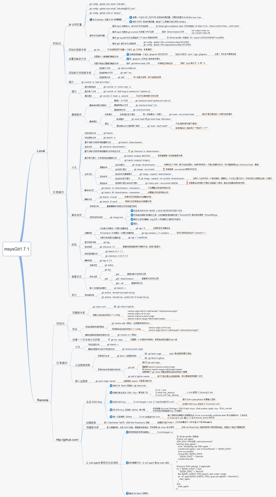

1.	撤销add操作： 
    git reset HEAD 如果后面什么都不跟的话 就是上一次add 里面的全部撤销了 
    git reset HEAD XXX/XXX/XXX.java 就是对某个文件进行撤销了
2.  撤销本地已追踪文件，有更改但未commit
    git checkout .  范围为当前目录下的文件
    git checkout -- . 范围是当前整个工作区的文件
2.	撤销commit操作
    git log 查看节点
    git reset commit_id （回退到上一个提交的节点 代码还是原来你修改的）
    git reset --soft HEAD~1 回退到上个版本 ~2上上个版本 
    git reset –hard commit_id （回退到上一个commit节点， 代码也发生了改变，变成上一次的）
3.	 还原已经提交的修改 
    (1).此次操作之前和之后的commit和history都会保留，并且把这次撤销作为一次最新的提交 
    git revert HEAD 撤销前一次 commit 
    git revert HEAD^ 撤销前前一次 commit 
    git revert commit-id (撤销指定的版本，撤销也会作为一次提交进行保存） 
    git revert是提交一个新的版本，将需要revert的版本的内容再反向修改回去，版本会递增，不影响之前提交的内容 
    (2).不会保留历史 
    git  reset --hard c1516a89b97fc6e4abbd79a7dc13448c5e689efa(版本号)

4.  更新远程分支信息（适用于刚新建分支，本地没有搜索到）
    git remote update origin -p
5.	报错：”Could Not Merge origin/master: You have not concluded your merge (MERGE_HEAD exists). “ 
    解决方法：可以先stash，再pull。
6.	暂存本地更改记录(可用于切换分支或解决冲突失败时)
    git stash save ct      ct 是暂存记录的名字,自定义的
    在使用git的时候，有些文件是不需要上传的，所以就可以修改   .gitignore 

 例如：
  如果是对所有文件都取消跟踪的话，就是
    git rm -r --cached . 　　//不删除本地文件
    git rm -r --f . 　　//删除本地文件
  对某个文件取消跟踪
    git rm --cached readme1.txt    删除readme1.txt的跟踪，并保留在本地。
    git rm --f readme1.txt    删除readme1.txt的跟踪，并且删除本地文件。
  不要误解了 .gitignore 文件的用途，该文件只能作用于 Untracked Files，也就是那些从来没有被 Git 记录过的文件（自添加以后，从未 add 及 commit 过的文件）。

## 所有的Git 命令
    add                     gc                      reflog
    add--interactive        get-tar-commit-id       remote
    am                      grep                    remote-ext
    annotate                gui                     remote-fd
    apply                   gui--askpass            remote-ftp
    archimport              gui--askyesno           remote-ftps
    archive                 gui.tcl                 remote-http
    askpass                 hash-object             remote-https
    bisect                  help                    repack
    bisect--helper          http-backend            replace
    blame                   http-fetch              request-pull
    branch                  http-push               rerere
    bundle                  imap-send               reset
    cat-file                index-pack              rev-list
    check-attr              init                    rev-parse
    check-ignore            init-db                 revert
    check-mailmap           instaweb                rm
    check-ref-format        interpret-trailers      send-email
    checkout                log                     send-pack
    checkout-index          ls-files                serve
    cherry                  ls-remote               sh-i18n--envsubst
    cherry-pick             ls-tree                 shortlog
    citool                  mailinfo                show
    clean                   mailsplit               show-branch
    clone                   merge                   show-index
    commit                  merge-file              stage
    commit-graph            merge-index             stash
    commit-tree             merge-octopus           status
    config                  merge-one-file          stripspace
    count-objects           merge-ours              submodule
    credential              merge-recursive         submodule--helper
    credential-manager      merge-resolve           subtree
    credential-store        merge-subtree           svn
    credential-wincred      merge-tree              symbolic-ref
    cvsexportcommit         mergetool               tag
    cvsimport               mktag                   unpack-file
    daemon                  mktree                  unpack-objects
    describe                mv                      update
    diff                    name-rev                update-git-for-windows
    diff-files              notes                   update-index
    diff-index              p4                      update-ref
    diff-tree               pack-objects            update-server-info
    difftool                pack-redundant          upload-archive
    difftool--helper        pack-refs               upload-pack
    fast-export             patch-id                var
    fast-import             prune                   verify-commit
    fetch                   prune-packed            verify-pack
    fetch-pack              pull                    verify-tag
    filter-branch           push                    web--browse
    fmt-merge-msg           quiltimport             whatchanged
    for-each-ref            read-tree               worktree
    format-patch            rebase                  write-tree
    fsck                    rebase--helper
    fsck-objects            receive-pack
  
### git场景
