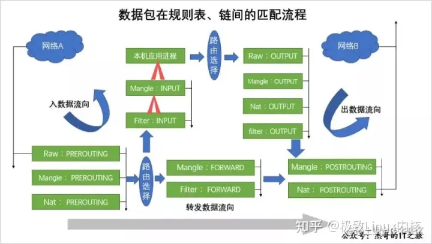

# Iptables- 四表五链

## 五链

### 路由前链接点 prerouting&#x20;

场景: 端口映射： DNat： 将入方向的目的地址（ip,port）修改为内网其他机器地址的（ip,port）

### 输入链接点  input&#x20;

&#x20;       负责本机的防护

### 转发节点 forward

&#x20;     负责后面机器的防护

### 路由后链接点 postrouting

&#x20;     场景：共享上网 SNAT， 修改出方向数据包的源地址，以便内网共享公网ip上网

### 输出链接点 ouput

&#x20;       一般不限制本机进程访问

## 规则链之间的顺序

- `入数据流向`：如果是外边的数据包到达防火墙后，要先通过`prerouting 链`：对数据包做路由选择之后，将应用此链中的规则，然后将进行路由选择，确认数据包的目标地址是否是防火墙本机，结合内核传送给`input`链做处理，确认通过之后，便可以交给服务器端来进行响应。
- `转发数据流向`：如果是外边的数据包到达防火墙后，要先通过`prerouting 链`做相关处理，随后进行路由选择，数据包的目标地址是任何其他地址的话，则将通过内核传给`forward`来进行处理是否需要通过或直接丢弃，最后将交给`postrouting 链`来查看是否有需要修改的数据包信息来进行处理。
- `出数据流向`：出流量，其实就是防火墙本机向外的地址发送数据包，首先被`output 链`处理，然后选择路由，然后在`postrouting 链`查看是否修改数据包的信息来进行处理。

# 四表 规则表

`iptables`管理着四个不同的规则表，分别由独立的内核模块实现。

- `filter 表`：用来对数据包进行过滤，具体的规则要求决定如何处理一个数据包。 &#x20;

  对应的内核模块为：`iptable_filter`，其表内包括三个链：`input`、`forward`、`output`;
- `nat 表`：nat 全称：network address translation 网络地址转换，`主要用来修改数据包的 IP 地址、端口号信息`。 &#x20;

  对应的内核模块为：`iptable_nat`，其表内包括三个链：`prerouting`、`postrouting`、`output`;
- `mangle 表`：主要用来修改数据包的`服务类型`，`生存周期`，为数据包设置标记，实现流量整形、策略路由等。 &#x20;

  对应的内核模块为：`iptable_mangle`，其表内包括五个链：`prerouting`、`postrouting`、`input`、`output`、`forward`;
- `raw 表`：主要用来决定是否对数据包进行状态跟踪。 &#x20;

  对应的内核模块为：`iptable_raw`，其表内包括两个链：`output`、`prerouting`;

## 规则表之间的顺序

当数据包到达防火墙时，如果对应的链内有规则存在，将按照顺序依次从`raw 表`→`mangle 表`→`nat 表`→`filter 表`。

## SNAT

## DNAT

### 网卡抓包：

tcpdump -i ens33 host 8.8.8.8 and icmp -nn

iptables -F  清空规则，范围： input，forward，output 这三个链上的规则，对prerouting和 postrouting不影响。
