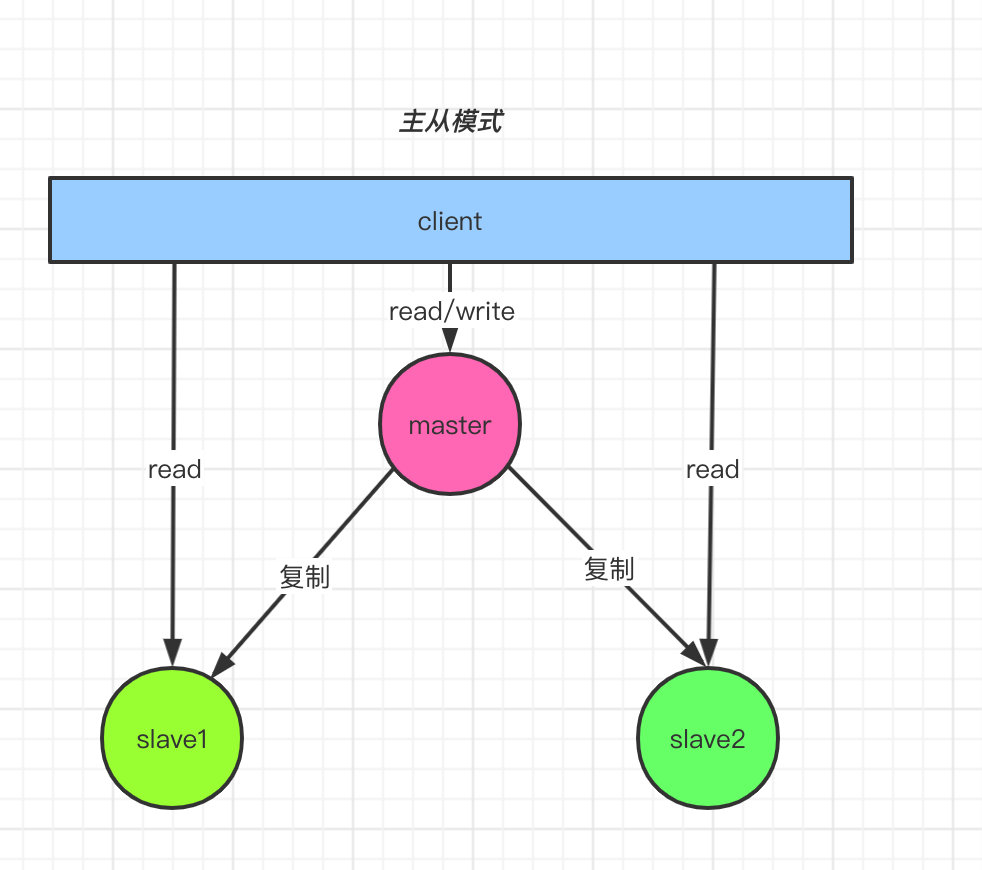
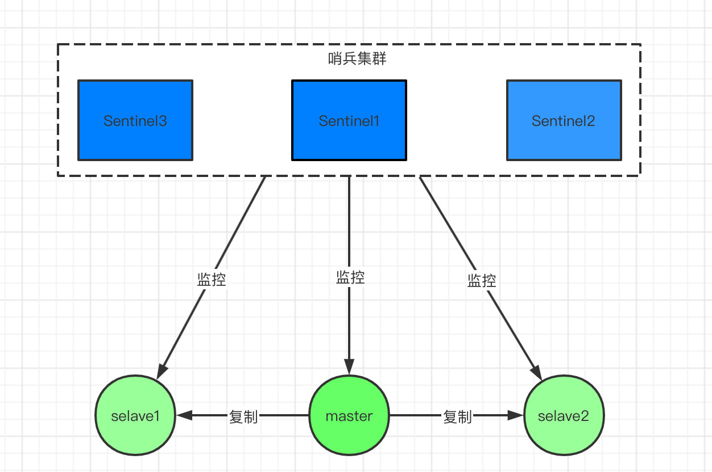
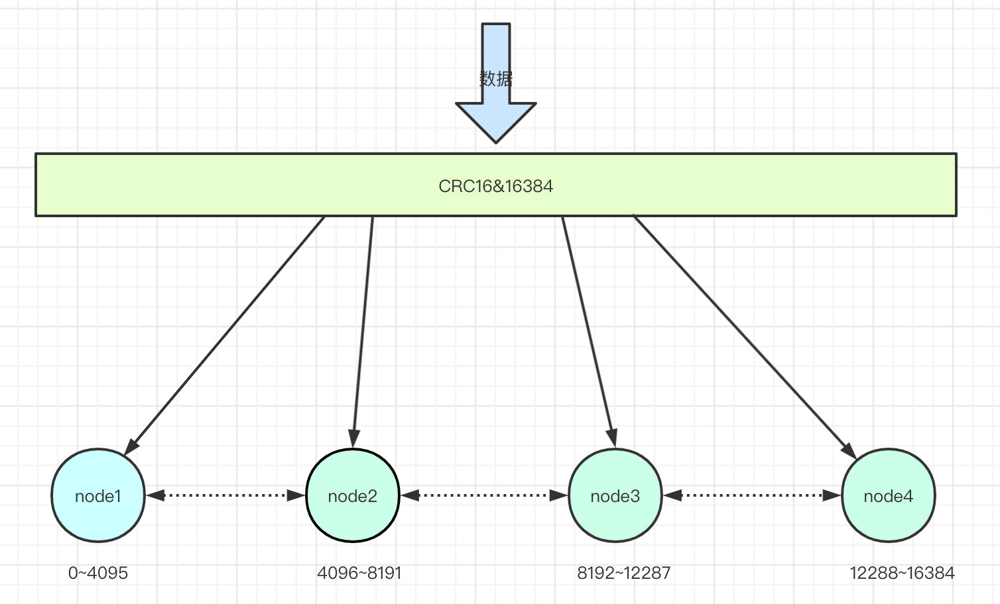
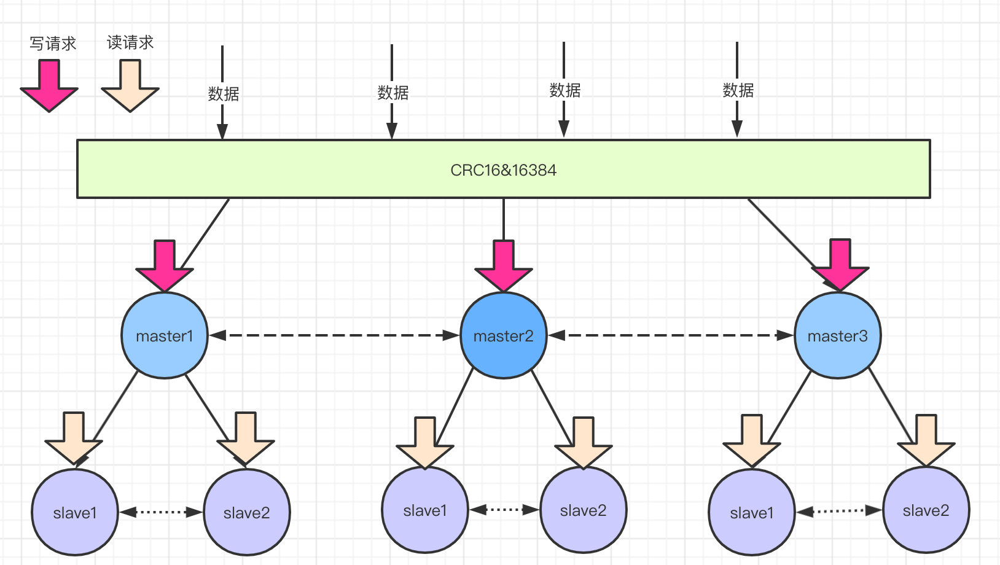
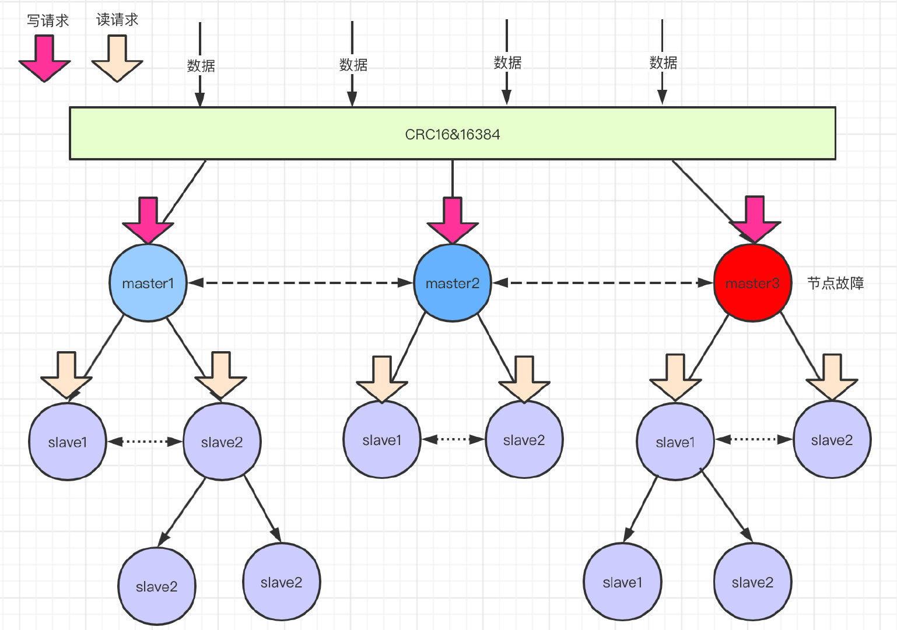

## Redis的四种模式 单机、主从、哨兵、集群


<!-- TOC -->

- [Redis的四种模式 单机、主从、哨兵、集群](#redis的四种模式-单机主从哨兵集群)
  - [1. 单机模式](#1-单机模式)
  - [2. 主从复制](#2-主从复制)
    - [2.1. 配置](#21-配置)
  - [3. 哨兵模式](#3-哨兵模式)
    - [哨兵模式监控的原理](#哨兵模式监控的原理)
  - [4. 集群模式](#4-集群模式)
    - [4.1. Cluster集群模式的原理](#41-cluster集群模式的原理)
      - [4.1.1. 数据分片怎么分？](#411-数据分片怎么分)
      - [4.1.2. 数据分片后如何查，怎么写？](#412-数据分片后如何查怎么写)
      - [4.1.3. 如何做到水平扩展](#413-如何做到水平扩展)
      - [4.1.4. 如果做到故障转移](#414-如果做到故障转移)
  - [5. 总结](#5-总结)

<!-- /TOC -->
### 1. 单机模式
> 只有一台机器部署了redis
- 优点： 部署简单、成本低、高性能，不需要同步数据。
- 缺点： 
    1. 可靠性不是很好，单节点有宕机的风险，
    2. 单机性能受限于cpu的处理能力。
> 使用场景：
   对并发性能要求不高，没有高可用需求，使用与简单的业务场景。

### 2. 主从复制
- 主从复制，是指将一台Redis服务器的数据，复制到其他的Redis服务器。
- 前者称为主节点(master)，后者称为从节点(slave)；数据的复制是单向的，只能由主节点到从节点。
- 在主从模式中，一般都会考虑 一个master挂在多个slave节点，当master服务宕机，会选举产生一个新的master，从而保证服务的高可用性。



#### 2.1. 配置
```yml
1 slaveof <masterip> <masterport>
2 # 例如
3 # slaveof 192.168.1.214 6379
```
> 启动**主从**节点的所有服务，查看日志即可以看到**主从**节点之间的服务连接。

> 主节点负责数据的写入  
从节点负责数据的读取
- 优点：
    1.  一旦主节点宕机，从节点作为主节点的**备份**可以随时顶上来。
    2. 扩展了**主节点**的**读能力**，分担主节点的读压力。
    3. 高可用基石：除了上述作用以外，主从复制还是哨兵模式和集群模式能实施的基础
- 缺点：
    1. 一旦**主节点宕机**，**从节点**晋升为**主节点**，同时需要修改应用方的主节点地址，还需要命令所有**从节点**去**复制**新的节点，整个过程需要**人工干预**。
    2. **主节点**的**写能力**受到**单机的限制**。
    3. **主节点**的**存储能力**受到**单机的限制**。
### 3. 哨兵模式
> 刚刚提到了，主从模式，当主节点宕机之后，从节点是可以作为主节点顶上来，继续提供服务的。  
但是有一个问题，主节点的IP已经变动了，此时应用服务还是拿着原主节点的地址去访问，这...  
于是，在Redis 2.8版本开始引入，就有了哨兵这个概念。  
在复制的基础上，哨兵实现了自动化的故障恢复。  

如上图所示：哨兵节点由两部分组成，哨兵节点和数据节点：
- 1. 哨兵节点： 哨兵系统由一个或多个哨兵节点组成，哨兵节点是特殊的redis节点，不存储数据。
- 2. 数据节点：主节点和从节点都是数据节点。

 > 访问redis集群的数据都是通过哨兵集群的，哨兵监控整个redis集群。  
 一旦发现redis集群出现问题，比如主节点挂了，从节点会顶上来，但是主节点地址变了，这时候引用服务无感知，也不用更改访问地址，因为哨兵才是和应用服务做交互的。  
 
 Sentinel 很好的解决了故障转移，在高可用方面又上升了一个台阶，当然Sentinel还有其他功能。比如：**主节点存活检测、主从运行情况检测、主从切换**  
 > **reids的sentinel的最小配置是一主一从**  
 #### 哨兵模式监控的原理
 
   
 - 交互流程：
    1. 每个Sentinel以每秒钟一次的频率，向它**所有的主服务器、从服务器以及其他Sentinel实例**发送一个**Ping**命令。
    2. 如果一个实例（instance）距离最后一次有效回复Ping命令的时间超过down-after-milliseconds所指定的值，那么这个实例会被Sentinel标记为**主观下线**
    3. 如果一个**主服务器**被标记为**主观下线**，那么正在监视这个主服务器的所有Sentinel **（至少要达到配置文件指定的数量）** 在指定的**时间范围**内同意这一判断，那么这个主服务器被标记为客观下线。
    4. 在一般情况下，每个sentinel会议每10秒一次的频率，向他已知的所有的主服务器和从服务器发送Info命令。
    5. 当一个**主服务器**被sentinel标记为**客观下线**时，sentinel向下线主服务器的所有从服务器发送Info命令的频率会从10秒一次改为每秒一次。
    6. 当没有足够数量的sentinel同意主服务器下线时，主服务器的**客观下线状态**就会被移除。当主服务器重新向sentinel的Ping命令返回有效回复时，主服务器的**主观下线状态**就会被移除。
- 哨兵模式的优缺点
    - 优点：
        1. 哨兵模式是基于主从模式的，所有主从的优点，哨兵模式都具有。
        2. 主从可以自动切换，系统更健壮，可用性更高。
        3. Sentinel 会不断的检查 主服务器 和 从服务器 是否正常运行。当被监控的某个 Redis 服务器出现问题，Sentinel 通过API脚本向管理员或者其他的应用程序发送通知。
    - 缺点：
        1. redis较难支持在线扩容，相交于集群，在线扩容很复杂。
### 4. 集群模式
> 背景：主从不能解决故障自动恢复问题，哨兵已经解决了，那为什么要有集群模式呢？
- 主从和哨兵都有一些问题没有解决，单个节点的存储能力是上限的，访问能力也是有上线的，所以redis的集群模式具有：**高可用、可扩展性、分布式、容错**等特性。
#### 4.1. Cluster集群模式的原理
- **通过数据分片的方式来进行数据共享，同时提供数据复制和故障转移功能**
- 之前的两种模式数据都在一个节点上，单个节点存储是存在上限的。集群模式就是把数据进行分片存储，当一个分片数据达到上限的是否，就分成多个分片。

##### 4.1.1. 数据分片怎么分？
集群的建空间被分割为16384个slots（即hash槽），通过hash的方式将数据分到不同的分片上。
```java
HASH_SLOT = CRC16(key) & 16384 
```
这里用了**位运算**得到取模结果，位运算的速度高于取模运算。
 
##### 4.1.2. 数据分片后如何查，怎么写？
 
 读请求分配给slave节点，写请求分配给master，数据同步从master到slave节点，读写分离提高并发能力，此功能有主从模式提供。
##### 4.1.3. 如何做到水平扩展
  当你新增一个master节点，需要做数据迁移，意味着redis的槽被分为三段，假设三段分别是0-7000、7001-1200、12001-16383。
  现在因为业务需要新增了一个master节点，四个节点共同占有16384个槽。
  槽需要重新分配，数据也需要重新迁移，但是服务不需要下线。
  redis集群的重新分片有redis内部的管理软件redis-trib负责执行。reids提供了重新分片的所有命令，redis-trib通过向节点发送命令来进行重新分片。
##### 4.1.4. 如果做到故障转移

- 假如途中红色的节点故障了，此时master3下面的从节点会通过 选举 产生一个主节点。替换原来的故障节点。此过程和哨兵模式的故障转移是一样的。

### 5. 总结
1. 每种模式都有各自的优缺点，在实际使用场景中要根据业务特点去选择合适的模式。
2. 单机模式部署简单，适用于简单业务，不能高可用和高并发
3. 主从模式在高并发和高可用方面有一定的提升，读写分离，提高业务的并发能力，但是高可用需要人工干预，如：重新设置主节点，并让其他从节点复制新的主节点的内容，修改业务方的主节点的地址。
4. 哨兵模式在高可用部分提升较大，可以自动的切换主从节点。不需要人工干预。但是数据量比较大，想扩容比较复杂。
5. 集群模式主要是提高了存储能力，之前都是单节点存储所有数据，集群模式下，数据是存在分片上的。在线扩容比较方便


