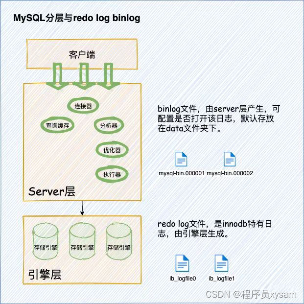

#### mysql


#### mysql 分层架构
- 在讲具体的日志之前，先稍微铺垫下MySQL分层的架构，让大家知道redo log、binlog是由MySQL的哪一层产生的。
- MySQL整体分为3层：客户端层，Server层和存储引擎层。我们的binlog日志，由Server层生成，redo log是InnoDB特有的日志，由InnoDB引擎生成。
- 



#### binlog 归档日志
- 作用：
  - 这个日志用来归档，也就是数据库的基于时间点的数据还原
  - MySQL 数据库的数据备份、主备、主主、主从都离不开 binlog，需要依靠 binlog 来同步数据，保证数据一致性，这也是它的主要主要——主从复制
- 日志格式
  - statement模式
    - 记录执行的原始sql语句，所以二进制日志文件最小，性能高，主从带宽小，但很容易出现主从不一致问题（比如执行uuid(),now()等函数时）
  - row模式
    - 交流数据行的更改情况，及数据行在更改前，更改后的变化情况，所以二进制日志文件最大，对性能影响大，主从复制带宽高，但主从复制下可靠性最好
  - mixed模式
    - 实际上是前两种模式的结合，有mysql决定选择哪一种。
**主从模式下强烈建议使用row格式**
- 数据库的Server层面，也有自己的日志，称为binlog（归档日志）
- 先查看下binlog里面的内容
   ```sql
    ## 登陆MySQL命令行
    mysql -uroot -p
    ## 刷新binlog
    flush logs;
    ## 确认刷新binlog成功
    show master status;
    ## 查询binlog日志位置
    show variables like'log_bin%';
    ```
- 执行sql操作
  ``` sql 
    ## 创建表
    ## 新增2条
    ## 删除1条  
  ```
- 翻译binlog二进制文进制
  > sudo /usr/local/mysql/bin/mysqlbinlog --base64-output=DECODE-ROWS -v mysql-bin.000006 > mysqlbin.sql


**由此可知，逻辑日志里边就是记录着sql语句，通过sql语句记录着逻辑的变化，比如insert, update等动作，但不是记录具体数据，那个由物理日志完成。**


#### 区别
- redo log是innoDB引擎特有的；binlog是MySQL的Server层实现的，所有引擎都能使用；
- redo log是循环写的，空间固定会用完；binlog是追加写入的。“追加写”是指binlog文件写到一定大小后会切换到下一个，并不会覆盖以前的日志。


#### redo log  重做日志
- InnoDB为了能够支持事务一系列操作，而事务有4种特性：原子性、一致性、隔离性、持久性，在事务操作中，要么全部执行，要么全部不执行，这就是事务的目的。
- 而我们的redo log用来保证事务的持久性，即我们常说的ACID中的D。我们只需要知道它是通过一套什么样的机制，来保证持久性，就能掌握好redo log。


#### undo log  
- undo log主要用来回滚到某一个版本，是一种逻辑日志。
- undo log记录的是修改之前的数据，比如：当delete一条记录时，undolog中会记录一条对应的insert记录，从而保证能恢复到数据修改之前。在执行事务回滚的时候，就可以通过undo log中的记录内容并以此进行回滚。


**Binlog主要用于数据恢复和数据复制，而Redo log则主要用于保证数据库的一致性和持久性。**

