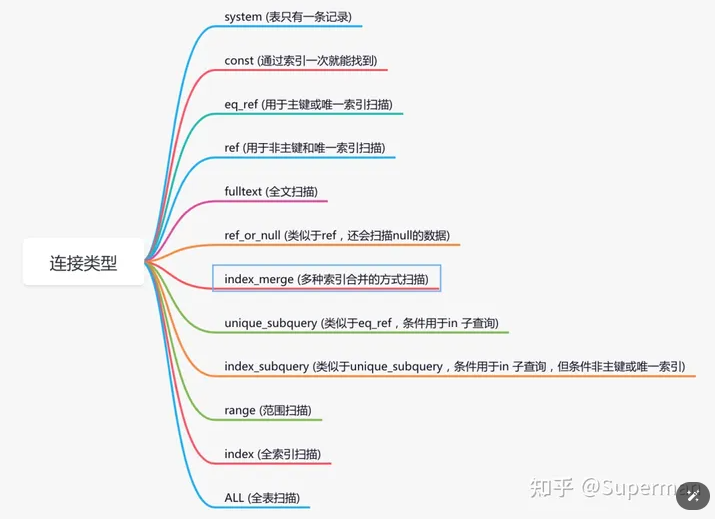

### msyql 慢查询 

#### 开启慢查询日志
- 检查是否开启慢查询
  -  SHOW VARIABLES LIKE 'slow_query_log';
  - 开启 慢查询
    - 修改mysql的配置文件，将slow_query_log  设置为on
    - 设置 慢查询的时间阈值：long_query_time 默认为10s
    - 设置log的存放路径：slow_query_log_file 
#### 使用 mysqldumpslow  工具分析慢查询日志
- mysqldumpslow -s t /路径/slowquery.log

#### 使用explain来查看sql的执行计划
- EXPLAIN命令：
  - 对于日志中记录的慢查询，使用EXPLAIN命令来查看查询的执行计划。分析查询是否使用了合适的索引，以及是否存在全表扫描等低效操作。

- 重点关注type列
  - 效果由好到坏的顺序如下：
  - system > const > eq_ref > ref > range > index > ALL

- 

#### 优化建议
- 根据EXPLAIN的输出结果，优化查询语句，比如添加或修改索引。
- 避免在查询中使用*，而是指定需要的列。
- 减少JOIN操作的数量或复杂性，特别是在大数据集上。
- 考虑将计算密集型的操作移到应用层进行。