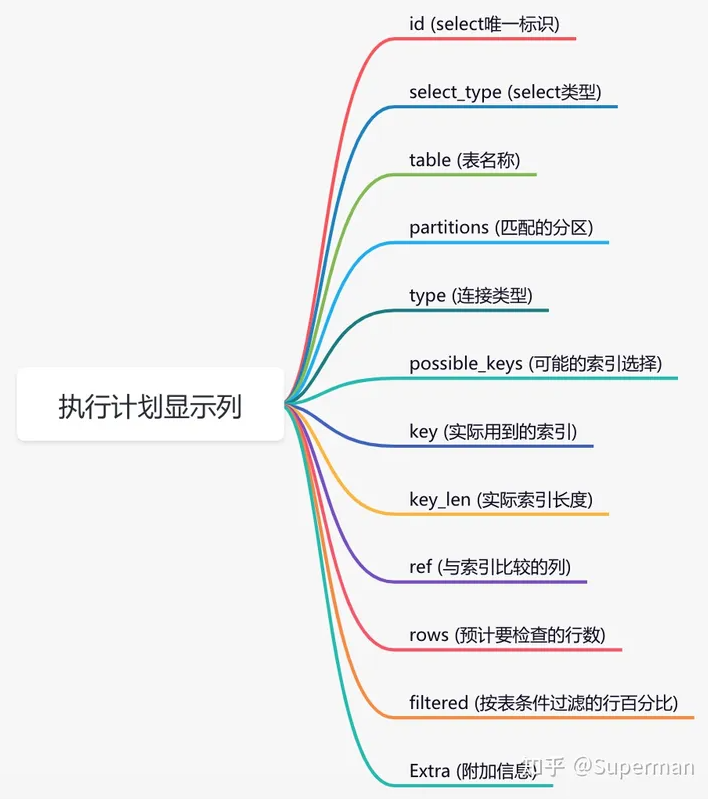

### msyql 慢查询 

#### 开启慢查询日志
- 检查是否开启慢查询
  -  SHOW VARIABLES LIKE 'slow_query_log';
  - 开启 慢查询
    - 修改mysql的配置文件，将slow_query_log  设置为on
    - 设置 慢查询的时间阈值：long_query_time 默认为10s
    - 设置log的存放路径：slow_query_log_file 
#### 使用 mysqldumpslow  工具分析慢查询日志
- mysqldumpslow -s t /路径/slowquery.log

#### 使用explain来查看sql的执行计划
- EXPLAIN命令：
  - 对于日志中记录的慢查询，使用EXPLAIN命令来查看查询的执行计划。分析查询是否使用了合适的索引，以及是否存在全表扫描等低效操作。

- 重点关注type列
  - 效果由好到坏的顺序如下：
  - system > const > eq_ref > ref > range > index > ALL
- system :表中只有一条记录，并且该表使用的存储引擎的统计数据是精确的，比如MyISAM、Memory，那么该表的type列的值就是system。这是const类型的特例，平时不会出现，也不用奢求将sql优化到这种级别的。
- const:表示通过索引（主键索引或唯一索引）一次就找到了那一条数据。
- eq_ref:唯一性索引扫描。对于每个索引键，表中只有一条记录与之匹配。常见于主键或唯一索引扫描。 eq_ref基本上很难在单表上出现，一般都是在多表的情况下才会出现eq_ref。
- ref:非唯一性索引扫描。大白话解释一下就是：出现该连接类型的条件是， 查找条件列使用了索引而且不是使用的主键索引和唯一索引（unique），使用的是普通索引
-  range:指的是有范围的索引扫描，相对于index的全索引扫描，它有范围限制，因此要优于index。
-  index:Full Index Scan。index与All区别为index类型只遍历索引树，通常比All要快，因为索引文件通常比数据文件要小
-  ALL:将表中的所有数据进行了扫描（全表扫描），从硬盘当中读取数据。如果出现了All 且数据量非常大，那么该条sql必须去做优化的。

**说下要求：一般来说，要保证SQL查询至少达到range级别，最好能达到ref级别。**

- 

- ref 列：索引是否被引入到，到底引用到了哪几个索引。
- Extra列：，Extra列是用来说明一些额外信息的，可以通过这些额外信息来更准确的理解mysql到底将如何执行给定的查询语句。

#### 优化建议
- 根据EXPLAIN的输出结果，优化查询语句，比如添加或修改索引。
- 避免在查询中使用*，而是指定需要的列。
- 减少JOIN操作的数量或复杂性，特别是在大数据集上。
- 考虑将计算密集型的操作移到应用层进行。